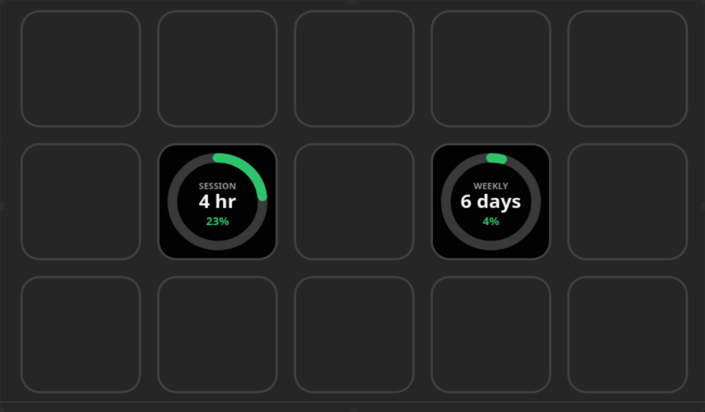

# Claude Code Usage OpenDeck plugin

An [OpenAction](https://openaction.amankhanna.me) plugin for [OpenDeck](https://github.com/nekename/OpenDeck) that tracks your [Claude Code](https://claude.com/claude-code) usage. The plugin is listed as **Claude Code Usage** in OpenDeck; its single action is **Usage**, under the `Claude Code` category.

The action shows a circular progress ring on the key:

- Ring fills to your current usage percentage.
- Ring color: green below 50%, yellow below 85%, red 85-100%.
- Center text: time until the next usage reset (e.g. `6 min.`, `2 hr`, `5 days`).
- Mode label at the top: `SESSION` (rolling 5-hour window) or `WEEKLY`.



## Requirements

- Rust (stable) to build.
- A Claude Code Pro, Max, Team, or Enterprise plan. Claude Code only reports rate-limit percentages for these plans, and only through an active interactive session (see below).

## Why this plugin needs a one-time setup

Claude Code has no HTTP API or headless CLI command for your session/weekly usage percentage — the only place Anthropic exposes it is the `rate_limits` object it feeds to a **statusLine** script while an interactive session is open (the same data behind the `/usage` screen). There is no way to "pull" this on demand from outside Claude Code.

So this plugin's binary doubles as that statusLine script:

1. When Claude Code invokes it with `--statusline-bridge`, it reads the JSON on stdin, pulls out `rate_limits.five_hour` (session) and `rate_limits.seven_day` (weekly), and writes them to a small cache file (in your OS cache directory, e.g. `~/.cache/oaclaudecode-usage/rate_limits.json` on Linux).
2. The plugin process running inside OpenDeck just reads that cache file every 30 seconds and renders the ring — no network calls, no API key.

**This means the key only has fresh data while Claude Code has been used recently.** If the cache file doesn't exist yet, or the relevant window has expired without a new statusLine event, the key shows a **"NO DATA — open Claude Code"** state instead of an error.

## Build & install

```sh
make install
```

This builds the plugin, stages it into `com.esteban-dcp.claudecodeusage.sdPlugin/`, and copies it into your OpenDeck plugins directory:

- Linux: `~/.config/opendeck/plugins/` (or `$XDG_CONFIG_HOME/opendeck/plugins/`)
- macOS: `~/Library/Application Support/OpenDeck/plugins/`

Restart OpenDeck (or reload plugins) and add the **Usage** action from the `Claude Code` category.

### Manual install

Run `make stage` to produce `com.esteban-dcp.claudecodeusage.sdPlugin/`, then copy that folder into your OpenDeck plugins directory (found via **Open config directory** in OpenDeck settings → `plugins/`).

## Packaging & releases

Run `make package` to assemble the plugin bundle and zip it into `com.esteban-dcp.claudecodeusage.zip`. The archive contains `com.esteban-dcp.claudecodeusage.sdPlugin/` and can be installed in OpenDeck via **Install from file**.

Releases are driven by PR labels. Every pull request to `main` must carry exactly one of the `major`, `minor`, or `patch` labels (validated by `.github/workflows/pr.yaml`). On merge, `.github/workflows/build.yml` bumps the version from that label, builds all five platform binaries (Windows, macOS, Linux; x86_64 + arm64), assembles the bundle, and publishes a GitHub Release with `com.esteban-dcp.claudecodeusage.zip` attached. CI writes the new version back into `Cargo.toml` and `assets/manifest.json` so they stay in sync with the release tag.

## Configuring the statusLine bridge (required, one time)

After `make install`, find the binary OpenDeck installed, e.g. on Linux:

```
~/.config/opendeck/plugins/com.esteban-dcp.claudecodeusage.sdPlugin/oaclaudecode-usage-x86_64-unknown-linux-gnu
```

Add (or edit) `~/.claude/settings.json` so Claude Code calls it as your statusLine:

```json
{
  "statusLine": {
    "type": "command",
    "command": "~/.config/opendeck/plugins/com.esteban-dcp.claudecodeusage.sdPlugin/oaclaudecode-usage-x86_64-unknown-linux-gnu --statusline-bridge"
  }
}
```

The bridge also prints a short fallback line (e.g. `Session 23% · Week 41%`) to stdout, so your status line stays useful even without a custom script.

**If you already have a custom `statusLine.command`:** you'll need to chain it — either have your own script also write the cache file, or run both commands and pass through your script's output (e.g. a small wrapper that calls your script for display and this binary in the background for the cache write). This plugin does not attempt to merge with an existing statusLine automatically.

Once configured, open a Claude Code session and send at least one message; `rate_limits` only appears after the session's first API response.

## Configuration

Select the action on your deck, then in the property inspector:

1. **Mode**: `Session (5h)` or `Weekly`.
2. **Show percentage**: toggle the usage percentage text on the key (default on). The countdown and layout are unchanged when hidden.

The key re-reads the cache file every 30 seconds. Press the key to force an immediate re-render (it still only reflects whatever is in the cache file at that moment).

## Development

```sh
cargo test       # run the render/countdown/cache unit tests
make stage       # build and assemble the .sdPlugin directory
cargo clippy     # lint
```
